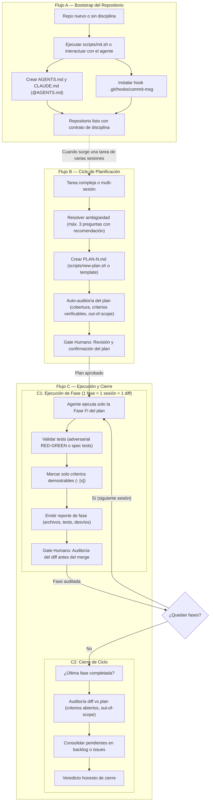

# Disciplined Scaffold

## 1. Qué es, en pocas palabras

`disciplined-scaffold` es una skill que instala dos cosas en un repo:
un contrato de convenciones para cualquier agente de IA que trabaje ahí
(commits convencionales, tests antes de cada commit, nunca dejar la suite
en rojo), y — cuando el trabajo lo amerita — un ciclo de planificación por
fases (`PLAN-N.md`) donde el agente ejecuta una fase por sesión, marca los
criterios cumplidos al cerrarla, y el humano audita cada diff antes de
mergear.

No reemplaza buen criterio. Formaliza el que ya tenían las personas del
equipo que trabajaban bien con agentes, para que todos lo tengan desde el
primer día en cualquier repo nuevo.

### 1.1 Mapa general de los tres flujos



## 2. Alcance honesto — leer antes de instalar

Esto es un **contrato de prosa**: un archivo que el agente lee y, con
buena probabilidad, sigue. No hay estado en disco a prueba de crash, no
hay locks, no hay nada que se recupere solo si una sesión muere a mitad de
una fase. Eso es aceptable para la enorme mayoría del trabajo — es
literalmente lo mismo que ya hacía cualquier desarrollador disciplinado
antes de que existieran agentes. Si algún proyecto del equipo necesita
memoria transaccional real (estado que sobrevive un crash, aprobación
enforced en código, múltiples agentes coordinando sobre el mismo estado),
eso requiere una herramienta con enforcement en código — ver sección 9.

Esto incluye los checkboxes de los planes: **marcar un criterio como
cumplido es un acto cooperativo del mismo agente que hizo el trabajo.**
Hace visible el estado, no lo hace verdadero. La skill le exige marcar
solo lo que puede demostrar en el momento, y dejar sin marcar lo que
requiere verificación humana — pero eso sigue siendo una regla que se
respeta, no un mecanismo que se impone.

La única pieza de esta skill que **sí** está enforced en código, 
es el hook de commits (sección 8). Todo lo demás depende de que el
agente lo respete.

## 3. Instalación

### 3.1 Claude Code CLI

Podés clonar o copiar la skill en `.claude/skills/`:

```bash
mkdir -p .claude/skills
git clone https://github.com/fdomerlo/disciplined-scaffold .claude/skills/disciplined-scaffold
# o si tenés el zip: unzip disciplined-scaffold.zip -d .claude/skills/
```

Se descubre sola al abrir Claude Code en el repo. Invocación manual disponible con
`/disciplined-scaffold` para forzar su carga.

### 3.2 Antigravity CLI e IDE

Antigravity lee skills de workspace en `.agents/skills/` (o globalmente en tu configuración):

```bash
mkdir -p .agents/skills
git clone https://github.com/fdomerlo/disciplined-scaffold .agents/skills/disciplined-scaffold
```

#### 3.2.1 OpenCode — requiere un paso extra

OpenCode no carga skills de forma nativa. Hace falta un command que
apunte al contenido en vez de duplicarlo:

`.opencode/commands/scaffold.md`:
```markdown
---
description: Bootstrap this repo or start a plan cycle using disciplined-scaffold
---
Read `.agents/skills/disciplined-scaffold/SKILL.md` and follow it for: $ARGUMENTS
```

### 3.3 Claude Chat (para uso individual, no de equipo)

Cada persona puede además guardarla en su cuenta personal de Claude vía botón 
*Save skill* al recibir el archivo (reemplazar extensión `.zip` con `.skill`)
Útil para planificar desde el chat antes de tener un repo abierto. Esto es 
individual y complementa, no sustituye, la instalación en el repo.

## 4. Los archivos de contrato: `AGENTS.md` + `CLAUDE.md`

La skill escribe el contrato **una sola vez**, en `AGENTS.md` en la raíz
del repo. Ese es el formato que leen de forma nativa OpenCode,
Antigravity, Codex y Cursor.

Claude Code utiliza `CLAUDE.md` como punto de entrada de memoria y reglas.
Para no duplicar el contrato y mantener una única fuente de verdad, la
documentación oficial recomienda importar `AGENTS.md` con una sola línea:

```
@AGENTS.md
```

Eso importa el contrato sin duplicarlo. Existe también la variante de
symlink (`ln -s AGENTS.md CLAUDE.md`), igual de oficial, pero requiere
modo desarrollador o permisos elevados en Windows — por eso la skill usa
el import por defecto.

**Nunca copiar la prosa del contrato en los dos archivos.** Dos copias 
de un contrato son dos contratos, y van a divergir. Si se encuentra un 
`CLAUDE.md` con contenido propio en el mismo repo, es un bug: hay que 
consolidarlo en `AGENTS.md` y dejar el import.

## 5. Flujo A — Bootstrap de un repo

Cuándo: repo nuevo, o uno existente sin convenciones claras para agentes.

### 5.1 Ejecución automatizada vía script CLI (Recomendado)

Si tenés la skill clonada o disponible localmente, podés ejecutar directamente:

```bash
bash scripts/init.sh -t "pytest" --with-hook
```

Opciones principales:
- `-t, --test-cmd`: Comando de tests (`pytest`, `npm test`, `cargo test`, etc.).
- `-p, --project-name`: Nombre del proyecto (por defecto: nombre del directorio).
- `-d, --target-dir`: Directorio destino (por defecto: `.`).
- `--with-hook`: Instala automáticamente `.git/hooks/commit-msg`.
- `-f, --force`: Sobrescribe si ya existen los archivos de contrato.

### 5.2 Ejecución conversacional con el agente

**Ejemplo de interacción real:**

> **Humano:** "Arrancamos un proyecto nuevo en Python con FastAPI, quiero
> setear las convenciones para trabajar con agentes."
>
> **Agente** (consulta la skill, pregunta lo mínimo):
> "¿Qué comando corre la suite de tests? ¿Instalo también el git hook que
> rechaza commits que no sigan conventional commits?"
>
> **Humano:** "pytest, y sí al hook."
>
> **Agente:** ejecuta `scripts/init.sh` (o escribe los archivos siguiendo el
> template) y reporta qué escribió.

Resultado: dos archivos (`AGENTS.md` y `CLAUDE.md`) y un hook en `.git/hooks/commit-msg`,
listos para que cualquier persona o agente que trabaje en ese repo siga las mismas reglas.

## 6. Flujo B — Ciclo de plan por fases

Cuándo: el trabajo va a llevar más de una sesión, más de una persona va a
tocar el diff antes de mergear, o un error ahí sale caro. Un fix de un
archivo no necesita esto — pedirlo directo, con buen mensaje de commit, 
es más disciplinado que la ceremonia de un plan innecesario.

**Ejemplo de interacción real:**

> **Humano:** "Necesitamos migrar el sistema de autenticación de sesiones a
> JWT. Es grande, va a llevar varias sesiones de trabajo."
>
> **Agente** (antes de escribir nada, pregunta lo que cambiaría la forma
> del plan, con su recomendación adjunta):
> "¿Los refresh tokens rotativos entran en este ciclo o quedan para otro?
> Recomiendo dejarlos afuera: duplican el alcance de F1 y no bloquean la
> migración. ¿De acuerdo?"
>
> **Humano:** "De acuerdo, afuera."
>
> **Agente:** crea `PLAN-1.md` (usando `scripts/new-plan.sh "Migración JWT"` o desde
> la plantilla), con el objetivo en una oración, evidencia de por qué, y fases
> concretas (F1: capa de emisión y validación de tokens; F2: migración de los
> endpoints; F3: deprecar el sistema viejo), cada una con spec, tests
> (distinguiendo fixes de features), y criterios de aceptación **como checkboxes**.
> Incluye "Out of scope" explícito con los refresh tokens. Antes de entregarlo
> hace una auto-auditoría y te la reporta en dos líneas: *"revisé el plan: F2
> tenía un criterio no verificable, lo reescribí."*
>
> **Humano:** *revisa el plan, ajusta lo que haga falta, y confirma*.
>
> **En cada sesión posterior:**
> "Ejecutá la Fase F1 según PLAN-1.md."
>
> El agente trabaja *solo esa fase*, y al terminar hace el cierre de fase
> (sección 7). Se detiene ahí — alguien del equipo audita el diff antes de
> mergear, como cualquier PR.

Si el agente encuentra el plan ambiguo o cree que está mal planteado,
**para y pregunta** en vez de adivinar — es la regla no negociable de todo
el sistema. Si hay una decisión que solo el humano puede tomar, el plan
puede entregarse igual, pero con esa decisión marcada como bloque
`## DECISIÓN ABIERTA` que el ejecutor tiene prohibido pasar de largo.

## 7. Flujo C — Cierre de fase y cierre de ciclo

Novedad de la v2. Son dos momentos distintos:

**Al terminar una fase**, antes de que nadie empiece la siguiente, el
agente:

1. Marca `- [x]` **solo** los criterios de aceptación que puede demostrar
   en ese momento — un test que corrió recién, un comando cuya salida
   tiene a la vista. Lo que requiere verificación humana (una sesión real
   en un host, algo visual) queda sin marcar y lo dice explícitamente:
   *"el criterio 3 de F2 necesita tu chequeo en OpenCode real, lo dejo sin
   marcar."*
2. Escribe el reporte: tabla de archivos cambiados, tests agregados **con
   qué ataque o regresión protege cada uno**, desviaciones del plan con su
   justificación, hallazgos que van a "Out of scope", y preguntas abiertas.
3. Se detiene.

**Al cerrar el ciclo** (después de la última fase, o cuando alguien
pregunta "¿qué falta?"), el agente hace una pasada de solo lectura:
lista los criterios sin marcar y clasifica cada uno (no hecho / hecho pero
no verificable por él / obsoleto porque el diseño cambió), compara el diff
real del ciclo contra lo que el plan pedía **en ambas direcciones** (¿hay
algo en el repo que ninguna fase pidió? ¿algo que una fase pidió y no
está?), nombra cualquier fuga de "Out of scope", y escribe los pendientes
donde el equipo los guarde. No abre el plan siguiente por su cuenta — eso
lo decide el equipo.

## 8. El git hook de commits convencionales

Instalado en `.git/hooks/commit-msg`. Rechaza cualquier primera línea de
commit que no siga el formato estándar de Conventional Commits (`tipo(scope): descripción`
o `tipo: descripción`), permitiendo los tipos:
`feat, fix, docs, style, refactor, perf, test, build, ci, chore, revert, release`.

Además, detecta y permite automáticamente operaciones nativas de Git:
`Merge...`, `Revert...`, `revert:...`, `fixup!...`, `squash!...`, comentarios (`#`)
y commits vacíos.

Ejemplos:

| Mensaje | Resultado |
|---|---|
| `feat(auth): add JWT validation` | ✅ pasa |
| `perf(db): optimize user query` | ✅ pasa |
| `Merge branch 'main' into dev` | ✅ pasa (operación nativa de git) |
| `Update auth.py` | ❌ rechazado |

Bypass para una emergencia real: `git commit --no-verify`. Cada persona
del equipo debería saber que existe — un hook que nadie sabe esquivar en
un apuro termina desinstalado en vez de respetado.

**Antes de instalar el hook en un repo del equipo, alguien debería leer
`scripts/commit-msg-hook.sh` una vez** — es corto (25 líneas) y no hace
nada más que lo descripto acá, pero cualquier script que se instala como
git hook merece esa revisión, sin excepciones, aunque lo hayamos escrito
nosotros mismos.

## 9. Relación con herramientas transaccionales (`context-guard`) — cuándo usar cada una

`disciplined-scaffold` y herramientas transaccionales como `context-guard`
abordan distintas etapas y necesidades del desarrollo asistido por agentes:

- **Disciplina de commits + ciclos planificados en texto**: sin necesidad de
  que el estado sobreviva a nivel de base de datos o daemon entre sesiones →
  `disciplined-scaffold` alcanza, es transparente y no añade dependencias.
- **Memoria transaccional con enforcement en código**: estado que se
  recupera solo tras un crash, aprobación humana obligatoria en código
  (no solo en texto), conteo determinista de tareas que el agente no puede
  falsear o coordinación multi-agente → requiere un motor transaccional
  dedicado como `context-guard`.

**Camino de ascenso:** un `PLAN-N.md` generado por esta skill está
estructurado de modo que herramientas de workflow transaccional pueden
leerlo e importarlo directamente sin tener que reescribir las fases a mano.

No son excluyentes: un mismo repositorio puede utilizar el contrato ligero de
`disciplined-scaffold` para el día a día y recurrir a herramientas más
pesadas en migraciones o tareas críticas.

## 10. Troubleshooting

**"El agente no usa la skill aunque describí una tarea grande."**
La activación es por relevancia de la description, no garantizada.
Invocación manual: `/disciplined-scaffold` en Claude Code fuerza la carga.
En claude.ai chat, sé más explícito en el pedido ("quiero un PLAN de
fases para esto").

**"Claude Code no ve el contrato."** Verificá que exista `CLAUDE.md` en la
raíz con la línea `@AGENTS.md`. Sin ese archivo, Claude Code ignora el
`AGENTS.md` por completo — no es un bug de la skill, es una limitación
conocida de Claude Code (sección 4).

**"El agente marcó un criterio que no está cumplido."** Es el modo de
falla conocido de los checkboxes (sección 2): son cooperativos. Corregilo
en el plan, y si pasa seguido con un modelo en particular, considerá
incorporar un harness con validación determinista de tareas para ese proyecto.

**"El hook rechaza un mensaje que me parece válido."**
Revisá que tenga el formato `tipo(scope): descripción` — el scope entre
paréntesis es opcional, pero el `tipo:` y el espacio después de los dos
puntos son obligatorios. Si de verdad hace falta un commit fuera de
formato (un merge automático, por ejemplo), `--no-verify`.

**"Dos integrantes tienen contratos distintos en el mismo repo."** Solo
puede pasar si alguien editó el `AGENTS.md` generado directamente en vez
de proponer el cambio por PR contra la skill (sección 11). El contrato de
un repo es único y versionado como cualquier otro archivo — no hay copias
personales.

**"¿Puedo usar esto sin instalar el hook?"** Sí, es opcional en ambos
flujos. El contrato en `AGENTS.md` sigue pidiendo commits convencionales;
sin el hook, esa regla queda como las demás — cooperativa, no forzada.

## 11. Gobernanza — cómo evoluciona el contrato sin divergir

Una vez que la skill está en varios repos del equipo, van a surgir pedidos
de cambio: un tipo de commit adicional, una regla nueva de estilo. Tratarlo
como código, no como convención verbal:

1. Cambios al `SKILL.md`, a los templates de `assets/` o a las referencias
   de `references/` se proponen por PR contra el repo donde vive la skill
   (o contra cada proyecto, si no hay un repo central — ver punto 3).
2. El PR se revisa como cualquier otro — la revisión de equipo es el
   control de calidad del contrato en sí.
3. Si el equipo tiene varios repos con esta skill instalada, considerá
   centralizarla en un repo propio (`team-skills` o similar) e
   incorporarla a cada proyecto como submódulo o mediante un script de
   sync corto — evita que un fix al contrato tenga que repetirse a mano en
   cada repo. No lo automaticen antes de que la fricción de mantenerlo a
   mano sea real; con dos o tres repos, copiar a mano en el mismo PR
   alcanza.

## 12. Referencia rápida

| Acción | Comando / paso |
|---|---|
| Instalar en un repo | `unzip disciplined-scaffold.zip -d .claude/skills/`, commitear |
| Arrancar el contrato en un repo nuevo | `bash <skill>/scripts/init.sh -t "<CMD>" --with-hook` o pedirlo al agente (Flujo A) |
| Empezar un trabajo grande | `bash <skill>/scripts/new-plan.sh "<TÍTULO>"` o pedir un plan al agente (Flujo B) |
| Ejecutar una fase | `"Ejecutá la Fase F{N} según PLAN-{N}.md"` |
| Cerrar una fase | `"Terminé F{N}"` → marca checkboxes y reporta (Flujo C) |
| Ver qué falta al final del ciclo | `"¿Qué quedó pendiente?"` (Flujo C) |
| Forzar la skill en Claude Code | `/disciplined-scaffold` |
| Bypass del hook en una emergencia | `git commit --no-verify` |
| ¿Necesito memoria transaccional real? | Ver sección 9 (motores transaccionales) |
